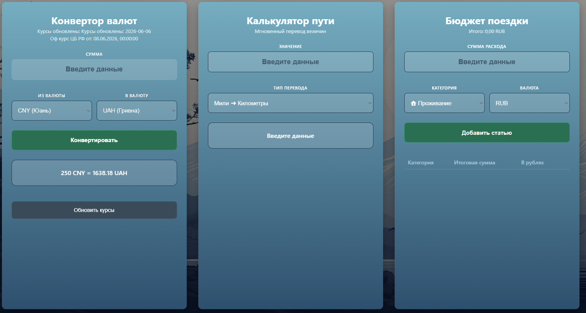

# Деплой: https://shrine1337.github.io/travel-calculator_finall/

##  Описание проекта

Добро пожаловать! Это мой **первый курсовой проект**. Здесь я применил все полученные знания на практике, настроил архитектуру приложения и развернул рабочую среду.
---


## 🛠️ Технологии


| Технология | Назначение |
| :--- | :--- |
| **HTML5** | Структура страницы |
| **CSS3** | Стилизация и адаптив |
| **JavaScript (ES6+)** | Логика приложения |
| **GitHub Pages** | Деплой


## Запуск проекта

### 1. Клонирование репозитория
```bash
git clone git@github.com:shrine1337/travel-calculator_finall.git
```
### 2. Переход в папку
```bash
cd travel-calculator_finall
```
### 3. Установка зависимостей
```bash
npm install
```

### 4. Запуск
```bash
npm run dev
```
>  **Важно:** Если при запуске возникает ошибка *Missing script: "dev"*, убедитесь, что вы находитесь в корневой папке с файлом `package.json` и данный скрипт прописан в конфигурации.

